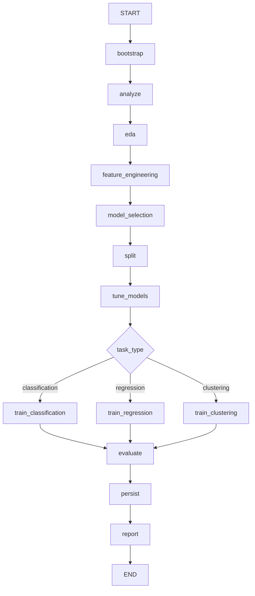

# Документация проекта SMADIMO-GP-3

## 1. Назначение проекта

Проект реализует автономного ИИ-агента для решения задач классического машинного обучения. Агент получает на вход:

- бизнес-задачу на естественном языке;
- путь к CSV-датасету;
- настройки LLM из `.env`.

После запуска агент сам проходит полный ML-пайплайн:

1. Анализирует датасет и бизнес-задачу.
2. Определяет тип задачи: `classification`, `regression` или `clustering`.
3. Определяет целевую переменную, если задача supervised.
4. Чистит данные.
5. Проводит EDA.
6. Создает новые признаки.
7. Выбирает пул моделей.
8. Делит данные на `train`, `val`, `test`.
9. Обучает модели.
10. Сравнивает модели по метрикам.
11. Оценивает лучшую модель на test.
12. Сравнивает результат с долговременной памятью.
13. Сохраняет итоговый отчет.

Проект построен на `LangChain`, `LangGraph`, `pandas`, `scikit-learn` и OpenAI-compatible LLM API. За счет OpenAI-compatible интерфейса можно использовать как локальную модель через LM Studio, так и внешний провайдер, например OpenRouter.

## 2. Основные файлы проекта

| Файл | Назначение |
| --- | --- |
| `main.py` | Простая точка входа для запуска агента из Python-кода. |
| `src/smadimo_agent/cli.py` | CLI-интерфейс для запуска агента из терминала. |
| `src/smadimo_agent/config.py` | Загрузка настроек LLM из `.env`, создание клиентов `ChatOpenAI`. |
| `src/smadimo_agent/workflow.py` | LangGraph workflow: фазы, переходы, retry, обработка ошибок. |
| `src/smadimo_agent/prompts.py` | System prompt и phase prompt для каждой фазы агента. |
| `src/smadimo_agent/ml_tools.py` | Все инструменты агента: анализ данных, очистка, EDA, FE, обучение, оценка, память, отчеты. |
| `src/smadimo_agent/io_utils.py` | Вспомогательные функции чтения/записи файлов и датасетов. |
| `src/smadimo_agent/state.py` | Описание состояния workflow и названия фаз. |
| `pyproject.toml` | Описание пакета, зависимостей и CLI-команды. |
| `README.md` | Исходное описание задания и требований проекта. |

## 3. Запуск проекта

### 3.1. Настройка `.env`

Проект не хранит конкретную модель в коде. Все настройки LLM берутся из `.env`.

Пример для LM Studio:

```env
LLM_API_KEY=lm-studio
LLM_BASE_URL=http://127.0.0.1:1234/v1
LLM_MODEL=qwen/qwen3.5-9b
LLM_TEMPERATURE=0.1
SMADIMO_OUTPUT_ROOT=artifacts
```

Пример для OpenRouter:

```env
LLM_API_KEY=ваш_токен
LLM_BASE_URL=https://openrouter.ai/api/v1
LLM_MODEL=openai/gpt-oss-20b:free
LLM_TEMPERATURE=0.1
SMADIMO_OUTPUT_ROOT=artifacts
```

Опционально можно указать отдельную модель для диагностики ошибок:

```env
LLM_REVIEW_MODEL=qwen/qwen3.5-9b
```

Если `LLM_REVIEW_MODEL` не указан, для диагностики используется основная модель из `LLM_MODEL`.

### 3.2. Запуск через `main.py`

В `main.py` есть функция:

```python
def run_agent(business_task, csv_path, output_root=None):
    ...
```

Пример:

```python
summary = run_agent(
    business_task="У нас есть датасет с данными об аренде квартир. Нужно понять факторы цены и предсказывать стоимость аренды.",
    csv_path="/path/to/dataset.csv",
)
```

Функция возвращает краткую сводку:

```json
{
  "run_id": "...",
  "task_type": "regression",
  "target_column": "price",
  "selected_models": ["ridge_regression", "random_forest_regressor"],
  "best_model_name": "ridge_regression",
  "report_path": ".../reports/run_report.md",
  "workspace_dir": ".../artifacts/runs/..."
}
```

### 3.3. Запуск через CLI

Если пакет установлен как проект, можно запускать:

```bash
smadimo-agent \
  --dataset /path/to/dataset.csv \
  --business-task "Описание бизнес-задачи" \
  --output-root artifacts
```

CLI описан в `src/smadimo_agent/cli.py`.

## 4. Конфигурация LLM

Файл `src/smadimo_agent/config.py` содержит класс `AgentConfig`.

Он отвечает за:

- чтение переменных окружения;
- проверку, что LLM endpoint доступен;
- создание основной модели;
- создание модели для диагностики ошибок.

### 4.1. `required_env`

```python
def required_env(name):
    value = os.getenv(name)
    if not value:
        raise RuntimeError(f"Environment variable `{name}` is required.")
    return value
```

Функция проверяет обязательные переменные окружения. Если переменной нет, запуск останавливается с понятной ошибкой.

Обязательные переменные:

- `LLM_MODEL`
- `LLM_BASE_URL`
- `LLM_API_KEY`

### 4.2. `AgentConfig.from_runtime`

Создает конфиг из `.env`:

```python
config = AgentConfig.from_runtime(output_root=output_root)
```

Значения:

- `model_name` берется из `LLM_MODEL`;
- `base_url` берется из `LLM_BASE_URL`;
- `api_key` берется из `LLM_API_KEY`;
- `review_model_name` берется из `LLM_REVIEW_MODEL`;
- `temperature` берется из `LLM_TEMPERATURE`, по умолчанию `0.1`;
- `output_root` берется из аргумента или из `SMADIMO_OUTPUT_ROOT`, по умолчанию `artifacts`.

### 4.3. `build_primary_model`

Создает основной LangChain-объект:

```python
ChatOpenAI(
    model=self.model_name,
    api_key=self.api_key,
    base_url=self.base_url,
    temperature=self.temperature,
    max_tokens=self.max_tokens,
    stream_usage=False,
)
```

Несмотря на название `ChatOpenAI`, объект работает не только с OpenAI. Он работает с любым OpenAI-compatible API, если провайдер поддерживает `/v1/chat/completions`.

### 4.4. `build_review_model`

Создает модель для объяснения ошибок. Она вызывается, если фаза упала с исключением. Если отдельная review-модель не задана, используется основная модель.

### 4.5. `ensure_llm_endpoint`

Проверяет endpoint перед запуском:

```python
models_url = config.base_url.rstrip("/") + "/models"
```

Если `/models` недоступен, агент останавливается до начала workflow.

## 5. Состояние агента

Файл `src/smadimo_agent/state.py` описывает названия фаз и структуру state.

### 5.1. Фазы

```python
PHASE_ANALYZE = "analyze"
PHASE_EDA = "eda"
PHASE_FEATURES = "feature_engineering"
PHASE_MODEL_SELECTION = "model_selection"
PHASE_SPLIT = "split"
PHASE_TUNE_MODELS = "tune_models"
PHASE_TRAIN_CLASSIFICATION = "train_classification"
PHASE_TRAIN_REGRESSION = "train_regression"
PHASE_TRAIN_CLUSTERING = "train_clustering"
PHASE_EVALUATE = "evaluate"
PHASE_PERSIST = "persist"
PHASE_REPORT = "report"
```

### 5.2. Выбор training-фазы

```python
TRAINING_PHASE_BY_TASK = {
    "classification": PHASE_TRAIN_CLASSIFICATION,
    "regression": PHASE_TRAIN_REGRESSION,
    "clustering": PHASE_TRAIN_CLUSTERING,
}
```

После split workflow смотрит на `task_type` и выбирает нужную ветку обучения.

### 5.3. `WorkflowState`

`WorkflowState` хранит данные между фазами:

- `business_task` - бизнес-задача;
- `dataset_path` - путь к исходному датасету;
- `workspace_dir` - директория текущего запуска;
- `run_id` - идентификатор запуска;
- `thread_id` - id thread для LangGraph checkpointer;
- `phase` - текущая фаза;
- `task_type` - тип ML-задачи;
- `target_column` - целевая переменная;
- `selected_models` - выбранные модели;
- `best_model_name` - лучшая модель текущего запуска;
- `best_model_path` - путь к лучшей модели;
- `report_path` - путь к итоговому отчету;
- `schema_summary` - краткая схема датасета;
- `history_comparison` - долговременная память;
- `artifacts` - найденные артефакты;
- `phase_outputs` - краткие выводы по фазам;
- `execution_log` - лог выполнения;
- `errors` - ошибки.

### 5.4. `StageAgentState`

`StageAgentState` используется внутри LangChain agent и содержит только данные, нужные LLM на текущей фазе:

- `phase`;
- `business_task`;
- `dataset_path`;
- `workspace_dir`;
- `task_type`;
- `target_column`;
- `schema_summary`.

## 6. Общая архитектура workflow

Workflow описан в `src/smadimo_agent/workflow.py`.

Основная функция:

```python
def run_pipeline(dataset_path, business_task, config):
    app = build_workflow(config, dataset_path=dataset_path, business_task=business_task)
    result = app.invoke({})
    return result
```

`build_workflow` создает LangGraph `StateGraph`.



## 7. Bootstrap-фаза

Функция `_bootstrap_node` создает рабочую директорию запуска.

Формат `run_id`:

```text
YYYYMMDD-HHMMSS-<dataset_name>
```

Пример:

```text
20260425-224836-apartments_for_rent_classified_10k
```

Создаются папки:

```text
artifacts/runs/<run_id>/
  analysis/
  data/
  data/cleaned/
  data/featured/
  modeling/
  modeling/splits/
  models/
  reports/
```

Также создается долговременная память:

```text
artifacts/runs/memory/
```

В начале запуска сохраняется `workflow_spec.json`. Этот файл фиксирует архитектуру workflow: список nodes и edges.

## 8. Ограничение tools по фазам

В `workflow.py` есть словарь `PHASE_TOOL_NAMES`. Он ограничивает, какие tools доступны агенту на каждой фазе.

Это важно, потому что агент не может случайно обучать модель на этапе EDA или писать отчет до обучения.

| Фаза | Доступные tools |
| --- | --- |
| `analyze` | `profile_dataset`, `get_dataset_schema`, `set_modeling_goal`, `analyze_distributions`, `clean_dataset` |
| `eda` | `profile_dataset`, `get_dataset_schema`, `analyze_distributions`, `run_eda` |
| `feature_engineering` | `profile_dataset`, `get_dataset_schema`, `run_eda`, `engineer_features` |
| `model_selection` | `profile_dataset`, `get_dataset_schema`, `run_eda`, `select_candidate_models` |
| `split` | `prepare_splits` |
| `tune_models` | `tune_models` |
| `train_classification` | `train_models` |
| `train_regression` | `train_models` |
| `train_clustering` | `train_models` |
| `evaluate` | `evaluate_models` |
| `persist` | `load_long_term_memory`, `load_best_model_from_memory`, `save_best_model` |
| `report` | `write_report` |

## 9. Проверка обязательных артефактов

После каждой фазы workflow проверяет, что нужные файлы реально появились на диске. Это защищает от ситуации, когда LLM просто написала текстовый ответ, но не вызвала tool.

Проверка находится в `_required_paths`.

### 9.1. `analyze`

Фаза считается завершенной, если созданы:

```text
analysis/dataset_profile.json
analysis/schema_snapshot.json
analysis/modeling_goal.json
analysis/distribution_report.json
analysis/cleaning_report.json
data/cleaned/cleaned_dataset.csv
```

### 9.2. `eda`

```text
analysis/eda_report.json
```

### 9.3. `feature_engineering`

```text
analysis/schema_snapshot.json
analysis/feature_report.json
data/featured/featured_dataset.csv
```

### 9.4. `model_selection`

```text
modeling/model_plan.json
```

### 9.5. `split`

```text
modeling/splits/train.csv
modeling/splits/val.csv
modeling/splits/test.csv
```

### 9.6. `tune_models`

```text
modeling/hyperparameter_tuning.json
```

### 9.7. Training

```text
modeling/leaderboard.json
```

### 9.8. `evaluate`

```text
modeling/evaluation.json
models/best_current_model.pkl
```

Если `evaluation.json` уже содержит поле `current_best_model_path`, проверяется именно путь из этого поля.

### 9.9. `persist`

```text
artifacts/runs/memory/best_registry.json
```

### 9.10. `report`

```text
reports/run_report.md
```

## 10. Retry и обработка ошибок

Workflow имеет два вида retry.

### 10.1. Retry при rate limit

Функция `_invoke_agent_with_rate_limit_retry` ловит `RateLimitError`. Если провайдер вернул rate limit, код ждет 65 секунд и повторяет вызов.

```python
except RateLimitError:
    time.sleep(65)
```

### 10.2. Retry при ошибке tool или LLM

Если внутри фазы возникает исключение, вызывается `_retry_message_from_error`.

Что происходит:

1. Ошибка передается в `_llm_error_explanation`.
2. LLM получает краткий prompt для диагностики.
3. Диагностика сохраняется в:

```text
errors/<phase>_error.json
```

4. Агент повторяет фазу с подсказкой, что пошло не так.

Если LLM-диагностика сама упала, используется простая эвристика `_guess_error_reason`.

### 10.3. Retry при недостающих артефактах

Если фаза завершилась без исключения, но обязательные файлы не появились, workflow:

1. Печатает лог в консоль.
2. Перечитывает state из workspace.
3. Добавляет агенту жесткую подсказку, какие tool нужно вызвать.
4. Повторяет фазу.

Например для `analyze` retry prompt говорит:

```text
Если нет modeling_goal.json, вызови set_modeling_goal.
Если нет distribution_report.json, вызови analyze_distributions.
Если нет cleaning_report.json или cleaned_dataset.csv, вызови clean_dataset.
```

Максимум выполняется 4 попытки фазы.

## 11. Промпты агента

Промпты находятся в `src/smadimo_agent/prompts.py`.

### 11.1. System prompt

Функция `build_system_prompt` формирует системный prompt.

Он содержит:

- роль агента;
- бизнес-задачу;
- текущую фазу;
- известный `task_type`;
- известный `target_column`;
- краткую схему датасета;
- общие правила;
- техники промптинга;
- инструкцию для конкретной фазы.

Ключевые правила:

- работать только через доступные tools;
- не имитировать выполнение tools текстом;
- опираться на факты из датасета;
- не менять постановку задачи без причины;
- следить за data leakage;
- не использовать вымышленные названия колонок;
- перед завершением этапа проверить, что обязательные действия выполнены.

### 11.2. Используемые техники промптинга

В коде явно используются:

- Role prompting: агенту задается роль senior ML engineer.
- Contrastive prompting: агенту запрещается выбирать решения, ведущие к leakage, случайному target selection и неподходящим моделям.
- Self-check prompting: агент должен перед завершением этапа проверить, что сделал все обязательные действия.
- Phase-specific tool routing: на каждой фазе доступны только релевантные tools.

### 11.3. Phase user message

Функция `build_phase_user_message` передает агенту текущий контекст:

- фазу;
- бизнес-задачу;
- путь к датасету;
- рабочую директорию;
- текущий target;
- текущий task type;
- краткую схему;
- уже созданные артефакты;
- краткие итоги предыдущих фаз.

Это кратковременная память workflow.

## 12. Инструкции по фазам

### 12.1. `analyze`

Цель: понять датасет и бизнес-задачу, определить target, тип задачи и очистить данные.

Обязательная последовательность:

1. `profile_dataset`
2. `get_dataset_schema`
3. `set_modeling_goal`
4. `analyze_distributions`
5. `clean_dataset`

Агент должен решить:

- какие поля являются числовыми;
- какие поля категориальные;
- какие поля текстовые;
- какие поля похожи на даты;
- какие поля являются идентификаторами;
- какая переменная является target;
- какая ML-задача решается;
- как обработать пропуски;
- нужно ли удалять строки;
- нужно ли удалять редкие значения;
- какие колонки убрать из модели.

### 12.2. `eda`

Цель: исследовать данные после очистки.

Обязательные tools:

1. `analyze_distributions`
2. `run_eda`

Результат:

- распределения значений;
- пропуски;
- выбросы;
- корреляции с target;
- дисбаланс классов для классификации;
- кандидаты на утечку target.

### 12.3. `feature_engineering`

Цель: создать минимум 2 новых признака.

Обязательные действия:

- вызвать `get_dataset_schema`;
- вызвать `engineer_features`;
- использовать только реальные колонки датасета;
- не использовать target как источник новых признаков.

### 12.4. `model_selection`

Цель: выбрать несколько моделей под тип задачи.

Tool:

```text
select_candidate_models
```

Агент должен выбрать минимум 2 модели.

Поддерживаемые модели:

```text
classification:
- logistic_regression
- random_forest_classifier
- gradient_boosting_classifier
- linear_svc
- k_neighbors_classifier

regression:
- ridge_regression
- sgd_regressor
- random_forest_regressor
- gradient_boosting_regressor
- k_neighbors_regressor

clustering:
- kmeans
- agglomerative_clustering
- dbscan
```

### 12.5. `split`

Цель: создать `train`, `val`, `test`.

Tool:

```text
prepare_splits
```

Для classification применяется stratify, если это возможно.

Для regression stratify не применяется.

Для clustering target не нужен.

### 12.6. `tune_models`

Цель: подобрать гиперпараметры для выбранных моделей.

Tool:

```text
tune_models
```

На этом этапе LLM является планировщиком. Она выбирает небольшое пространство поиска для моделей из `model_plan.json`, а Python tool реально обучает конфигурации на `train` и сравнивает их на `val`.

Результат:

- `modeling/hyperparameter_tuning.json`;
- `best_params_by_model` для дальнейшего обучения.

### 12.7. Training

После `tune_models` workflow выбирает ветку:

- `train_classification`;
- `train_regression`;
- `train_clustering`.

Во всех трех случаях вызывается один tool:

```text
train_models
```

Разница определяется `task_type`.

Если для модели есть подобранные гиперпараметры, `train_models` использует их. Если файла подбора нет или для модели нет параметров, модель обучается с базовыми параметрами.

### 12.8. `evaluate`

Цель: взять лучшую модель по validation и оценить ее на test.

Tool:

```text
evaluate_models
```

Результат:

- `modeling/evaluation.json`;
- `models/best_current_model.pkl`.

### 12.9. `persist`

Цель: сравнить текущий запуск с долговременной памятью.

Tools:

1. `load_long_term_memory`
2. `load_best_model_from_memory`
3. `save_best_model`

Если текущая модель лучше исторической, она копируется в память.

### 12.10. `report`

Цель: собрать финальный отчет.

Tool:

```text
write_report
```

Результат:

- `reports/run_report.md`;
- `reports/run_report.json`.

## 13. Все tools агента

Все tools находятся в `src/smadimo_agent/ml_tools.py`.

### 13.1. `profile_dataset`

Назначение: первичный профиль датасета.

Читает активный датасет и сохраняет:

- размер датасета;
- список колонок;
- типы колонок;
- роли колонок;
- пропуски;
- дубликаты;
- кандидаты в target.

Артефакт:

```text
analysis/dataset_profile.json
```

### 13.2. `get_dataset_schema`

Назначение: зафиксировать актуальную схему датасета.

Используется несколько раз, потому что датасет меняется после очистки и feature engineering.

Сохраняет:

- роли колонок;
- колонки по группам;
- краткую строку `summary`.

Артефакт:

```text
analysis/schema_snapshot.json
```

### 13.3. `set_modeling_goal`

Назначение: сохранить ML-постановку.

Параметры:

- `target_column`;
- `task_type`;
- `reasoning`.

Для `classification` и `regression` target обязан существовать в датасете.

Для `clustering` target сохраняется как `None`.

Артефакт:

```text
analysis/modeling_goal.json
```

Пример содержимого:

```json
{
  "target_column": "price",
  "task_type": "regression",
  "reasoning": "Бизнес-задача требует предсказывать стоимость аренды."
}
```

### 13.4. `analyze_distributions`

Назначение: посмотреть распределения значений до решения об очистке.

Сохраняет по каждой колонке:

- dtype;
- количество пропусков;
- число уникальных значений;
- топ-20 значений;
- долю каждого топ-значения;
- доминирующее значение;
- редкие значения в топ-20.

Артефакт:

```text
analysis/distribution_report.json
```

Этот tool нужен, чтобы агент мог заметить ситуации вида:

- 99% строк имеют одно значение;
- 1% строк имеют другое значение;
- редкое значение может быть отдельным бизнес-кейсом;
- иногда лучше удалить строки, чем заполнять модой или медианой.

### 13.5. `clean_dataset`

Назначение: очистить исходный датасет.

Принимает простые аргументы. Это сделано специально для локальных LLM, которые часто ошибаются при передаче вложенного объекта `plan`.

Аргументы:

- `drop_columns` - строка со списком колонок для удаления, например `"[\"id\",\"title\"]"` или `"id,title"`;
- `drop_rows` - строка с JSON-списком правил удаления строк;
- `numeric_imputation` - заполнение числовых пропусков: `median`, `mean`, `none`;
- `categorical_imputation` - заполнение категориальных пропусков: `mode`, `constant`, `none`;
- `text_imputation` - заполнение текстовых пропусков: `empty`, `constant`, `none`;
- `outlier_strategy` - обработка выбросов: `iqr_clip`, `none`;
- `cleaning_reasoning` - общее объяснение очистки.

Шаблон вызова:

```text
clean_dataset(
  drop_columns="[\"id\",\"title\",\"body\"]",
  drop_rows="[{\"column\":\"fee_period\",\"value\":\"weekly\",\"reason\":\"weekly rent is a different business case\"}]",
  numeric_imputation="median",
  categorical_imputation="mode",
  text_imputation="empty",
  outlier_strategy="iqr_clip",
  cleaning_reasoning="Короткое обоснование очистки."
)
```

Артефакты:

```text
analysis/cleaning_report.json
data/cleaned/cleaned_dataset.csv
```

### 13.6. `run_eda`

Назначение: EDA на активном датасете.

Сохраняет:

- размер датасета;
- роли колонок;
- пропуски;
- распределения;
- выбросы по числовым колонкам;
- target distribution для classification;
- корреляции с target для числового target;
- кандидаты на leakage.

Артефакты:

```text
analysis/eda_report.json
analysis/eda_report.md
```

### 13.7. `engineer_features`

Назначение: создать новые признаки.

Принимает:

- `feature_specs`;
- `note`.

Поддерживаемые виды признаков:

| `kind` | Что делает |
| --- | --- |
| `ratio` | Делит одну числовую колонку на другую. |
| `difference` | Вычитает одну числовую колонку из другой. |
| `product` | Перемножает две числовые колонки. |
| `sum` | Складывает две числовые колонки. |
| `text_length` | Считает длину текста. |
| `text_word_count` | Считает количество слов. |
| `date_part` | Извлекает часть даты: год, месяц, день, день недели, квартал. |
| `is_missing` | Создает бинарный индикатор пропуска. |
| `category_frequency` | Кодирует категорию ее частотой. |

Важная защита:

- target нельзя использовать как источник feature;
- несуществующие колонки пропускаются;
- несовместимые типы колонок пропускаются;
- если агент предложил меньше 2 валидных признаков, код добавляет auto-feature candidates;
- если невозможно создать минимум 2 признака, выбрасывается ошибка.

Артефакты:

```text
analysis/feature_report.json
data/featured/featured_dataset.csv
```

### 13.8. `select_candidate_models`

Назначение: выбрать пул моделей.

Принимает `ModelSelectionPlan`:

- `model_names`;
- `reasoning`.

Tool нормализует названия моделей. Например:

- `RandomForestRegressor` -> `random_forest_regressor`;
- `XGBRegressor` -> `gradient_boosting_regressor`;
- `LinearRegression` -> `ridge_regression`.

Если LLM выбрала меньше 2 валидных моделей, код добавляет fallback-модели.

Артефакт:

```text
modeling/model_plan.json
```

### 13.9. `prepare_splits`

Назначение: создать train/val/test.

Принимает `SplitPlan`:

- `test_size`, по умолчанию `0.2`;
- `val_size`, по умолчанию `0.1`;
- `stratify`, по умолчанию `True`.

Логика:

- для classification пытается делать stratify по target;
- для regression делает обычный split;
- для clustering target не нужен.

Артефакты:

```text
modeling/splits/train.csv
modeling/splits/val.csv
modeling/splits/test.csv
modeling/splits/split_manifest.json
```

### 13.10. `tune_models`

Назначение: подобрать гиперпараметры для моделей, которые уже выбраны на этапе `model_selection`.

Принимает прямые аргументы tool:

- `n_iter` - сколько конфигураций проверять на модель, максимум ограничен в коде;
- `model_spaces` - строка с JSON, где описано пространство поиска по моделям;
- `reasoning` - объяснение выбора пространства поиска.

Пример:

```json
{
  "n_iter": 6,
  "model_spaces": {
    "ridge_regression": {
      "alpha": [0.1, 1.0, 10.0, 100.0]
    },
    "random_forest_regressor": {
      "n_estimators": [100, 200],
      "max_depth": [null, 10, 20],
      "min_samples_leaf": [1, 3]
    }
  },
  "reasoning": "Для регрессии оптимизируем RMSE и ограничиваем перебор, чтобы запуск был быстрым."
}
```

LLM только планирует пространство поиска. Лучшие параметры выбирает Python-код по validation-метрикам.

Важно: `tune_models` не принимает вложенный аргумент `plan`. `model_spaces` специально сделан строкой с JSON, потому что локальные LLM иногда передают вложенный dict некорректно. Внутри tool Python сам парсит эту строку.

Рекомендуемый шаблон для LLM:

```text
tune_models(
  n_iter=6,
  model_spaces="{\"ridge_regression\":{\"alpha\":[0.1,1.0,10.0]},\"random_forest_regressor\":{\"n_estimators\":[50,100],\"max_depth\":[3,5,null],\"min_samples_leaf\":[2,4]}}",
  reasoning="Короткое объяснение выбора пространства поиска."
)
```

Парсер внутри tool дополнительно умеет вытаскивать JSON-объект из лишнего текста или тегов вида `<parameter=model_spaces>...</parameter>`.

Если LLM не задала пространство для модели, tool использует безопасное дефолтное пространство.

Артефакт:

```text
modeling/hyperparameter_tuning.json
```

### 13.11. `train_models`

Назначение: обучить выбранные модели и сравнить их на validation.

Что делает:

1. Читает `model_plan.json`.
2. Читает `train.csv` и `val.csv`.
3. Читает `hyperparameter_tuning.json`, если он есть.
4. Для каждой модели берет лучшие гиперпараметры из `best_params_by_model`.
5. Для каждой модели строит pipeline.
6. Обучает модель.
7. Считает validation-метрики.
8. Сохраняет модель в `.pkl`.
9. Формирует leaderboard.

Артефакты:

```text
models/<model_name>_validation.pkl
modeling/leaderboard.json
```

### 13.12. `evaluate_models`

Назначение: оценить лучшую модель текущего запуска на test.

Что делает:

1. Берет лучшую модель из `leaderboard.json`.
2. Объединяет `train` и `val`.
3. Переобучает лучшую модель на `train + val`.
4. Оценивает на `test`.
5. Сохраняет лучшую текущую модель.

Артефакты:

```text
modeling/evaluation.json
models/best_current_model.pkl
```

### 13.13. `load_long_term_memory`

Назначение: прочитать исторически лучшую модель и метрики.

Читает:

```text
artifacts/runs/memory/best_registry.json
```

Если памяти нет, возвращает сообщение, что память пустая.

### 13.14. `load_best_model_from_memory`

Назначение: загрузить исторически лучшую модель из `.pkl` и проверить совместимость с текущей задачей.

Проверяет:

- совпадает ли `task_type`;
- совпадает ли `target_column`;
- существует ли файл модели.

Артефакт:

```text
modeling/memory_baseline.json
```

Важно: tool загружает `.pkl` файл, проверяет совместимость и записывает baseline-статус. Он не дообучает старую модель.

### 13.15. `save_best_model`

Назначение: обновить долговременную память, если текущая модель лучше исторической.

Сравнение идет по `selection_score`.

Если текущий score лучше:

- `models/best_current_model.pkl` копируется в `artifacts/runs/memory/best_model.pkl`;
- обновляется `best_registry.json`;
- обновляется `best_model_meta.json`.

Если текущий score хуже или равен, память не меняется.

### 13.16. `write_report`

Назначение: собрать итоговый отчет.

Читает все основные JSON-артефакты и создает:

```text
reports/run_report.md
reports/run_report.json
```

В отчет попадает:

- бизнес-задача;
- путь к датасету;
- task type;
- target;
- размер датасета;
- очистка;
- distribution analysis;
- EDA;
- созданные признаки;
- выбранные модели;
- validation metrics;
- test metrics;
- исторический лучший результат;
- использованные техники промптинга.

## 14. Внутренняя обработка данных

### 14.1. Определение ролей колонок

Функция `_infer_column_roles` классифицирует колонки:

- `numeric`;
- `categorical`;
- `text`;
- `datetime`;
- `datetime_candidate`;
- `identifier`;
- `target`.

Логика основана на:

- pandas dtype;
- доле уникальных значений;
- названии колонки;
- средней длине текста;
- среднем количестве слов;
- возможности распарсить значения как дату.

### 14.2. Активный датасет

Функция `_active_dataset_path` выбирает, с каким датасетом работать:

1. Если есть `data/featured/featured_dataset.csv`, используется он.
2. Иначе если есть `data/cleaned/cleaned_dataset.csv`, используется он.
3. Иначе используется исходный датасет.

Это позволяет разным фазам автоматически работать с самой актуальной версией данных.

### 14.3. Подготовка признаков для ML

Функция `_prepare_feature_table` удаляет из признаков:

- identifier-колонки;
- сырые text-колонки;
- datetime-колонки;
- datetime_candidate-колонки.

После этого остаются числовые и категориальные признаки.

Target не удаляется на этом шаге, потому что дальше он отдельно отделяется от `X`.

### 14.4. Preprocessing pipeline

Для supervised-задач строится `ColumnTransformer`:

- numeric pipeline:
  - `SimpleImputer(strategy="median")`;
  - `StandardScaler`;
- categorical pipeline:
  - `SimpleImputer(strategy="most_frequent")`;
  - `OneHotEncoder(handle_unknown="ignore", sparse_output=False)`.

Затем этот preprocessor объединяется с моделью в sklearn `Pipeline`.

## 15. Поддерживаемые ML-задачи

### 15.1. Classification

Target обязателен.

Модели:

- `logistic_regression`;
- `random_forest_classifier`;
- `gradient_boosting_classifier`;
- `linear_svc`;
- `k_neighbors_classifier`.

Метрики:

- `accuracy`;
- `precision`;
- `recall`;
- `f1`;
- `roc_auc`, если задача бинарная и модель поддерживает probability или decision scores.

Selection score:

```text
roc_auc или f1
```

### 15.2. Regression

Target обязателен.

Модели:

- `ridge_regression`;
- `sgd_regressor`;
- `random_forest_regressor`;
- `gradient_boosting_regressor`;
- `k_neighbors_regressor`.

Метрики:

- `rmse`;
- `mae`;
- `r2`;
- `mape`, если его можно посчитать.

Selection score:

```text
-rmse
```

Score отрицательный специально: workflow сортирует модели по убыванию, а для RMSE меньше значит лучше. Поэтому `-rmse` позволяет использовать общий принцип: чем больше `selection_score`, тем лучше.

### 15.3. Clustering

Target не нужен.

Модели:

- `kmeans`;
- `agglomerative_clustering`;
- `dbscan`.

Метрики:

- `silhouette`;
- `davies_bouldin`;
- `calinski_harabasz`.

Selection score:

```text
silhouette
```

## 16. Долговременная память

Долговременная память хранится в:

```text
artifacts/runs/memory/
```

Файлы:

```text
best_registry.json
best_model.pkl
best_model_meta.json
```

### 16.1. `best_registry.json`

Хранит информацию о лучшем историческом результате:

```json
{
  "best_run": {
    "best_model_name": "ridge_regression",
    "selection_score": -552.49,
    "task_type": "regression",
    "target_column": "price",
    "model_path": ".../memory/best_model.pkl",
    "source_run_model_path": ".../models/best_current_model.pkl"
  }
}
```

### 16.2. Почему score может быть отрицательным

Для regression используется `-rmse`.

Пример:

- модель A: RMSE = 600, score = -600;
- модель B: RMSE = 550, score = -550.

Так как `-550 > -600`, модель B считается лучше.

### 16.3. Когда память обновляется

Память обновляется только если:

```python
current_score > previous_score
```

Для classification это значит выше `roc_auc` или `f1`.

Для regression это значит ниже `rmse`.

Для clustering это значит выше `silhouette`.

## 17. Артефакты одного запуска

Типичная структура:

```text
artifacts/runs/<run_id>/
  workflow_spec.json
  analysis/
    dataset_profile.json
    schema_snapshot.json
    modeling_goal.json
    distribution_report.json
    cleaning_report.json
    eda_report.json
    eda_report.md
    feature_report.json
  data/
    cleaned/
      cleaned_dataset.csv
    featured/
      featured_dataset.csv
  modeling/
    model_plan.json
    hyperparameter_tuning.json
    leaderboard.json
    evaluation.json
    memory_baseline.json
    splits/
      train.csv
      val.csv
      test.csv
      split_manifest.json
  models/
    <model_name>_validation.pkl
    best_current_model.pkl
  reports/
    run_report.md
    run_report.json
  errors/
    <phase>_error.json
```

Папка `errors/` появляется только если была ошибка.

## 18. Что делает `io_utils.py`

Файл содержит простые функции ввода-вывода.

### 18.1. `slugify`

Преобразует строку в безопасный slug для имени папки.

Используется для `run_id`.

### 18.2. `now_run_id`

Возвращает timestamp:

```text
YYYYMMDD-HHMMSS
```

### 18.3. `normalize_for_json`

Преобразует значения numpy, pandas и Path в типы, которые можно сохранить в JSON.

Например:

- `np.int64` -> `int`;
- `np.float64` -> `float`;
- `np.ndarray` -> `list`;
- `Path` -> `str`;
- `NaN` -> `None`.

### 18.4. `write_json`

Сохраняет словарь в JSON с `ensure_ascii=False` и `indent=2`.

### 18.5. `read_json`

Читает JSON. Если файла нет и передан `default`, возвращает default.

### 18.6. `_detect_csv_delimiter`

Определяет разделитель CSV:

- `,`;
- `;`;
- `|`;
- tab.

Сначала пробует `csv.Sniffer`, затем fallback по первой строке.

### 18.7. `read_table`

Читает датасет по расширению:

- `.csv`;
- `.parquet`;
- `.pq`;
- `.xlsx`;
- `.xls`;
- `.json`;
- `.jsonl`.

Для CSV использует auto delimiter detection и `engine="python"`, чтобы лучше переживать нестандартные CSV.

### 18.8. `write_table`

Сохраняет DataFrame:

- `.csv`;
- `.parquet`;
- `.pq`.

## 19. Как агент выбирает target

Target выбирает LLM на фазе `analyze` через tool `set_modeling_goal`.

Перед этим агент получает:

- бизнес-задачу;
- профиль датасета;
- схему датасета;
- список candidate targets из `profile_dataset`;
- реальные названия колонок.

Например, если бизнес-задача звучит как:

```text
предскажи стоимость аренды для новых объявлений
```

И в датасете есть колонка `price`, агент должен выбрать:

```json
{
  "target_column": "price",
  "task_type": "regression"
}
```

Код дополнительно проверяет, что target существует в датасете. Если LLM придумала колонку, `set_modeling_goal` упадет с ошибкой.

## 20. Как target убирается из train

Target физически остается в `train.csv`, `val.csv`, `test.csv`, потому что split-файлы хранят полный датасет.

Но при обучении target отделяется:

```python
X_train = feature_train.drop(columns=[target_column])
y_train = feature_train[target_column]
```

То есть модель не получает target как feature.

Дополнительно `_feature_kind_is_compatible` запрещает использовать target при feature engineering.

## 21. Защита от ошибок LLM

В проекте есть несколько уровней защиты.

### 21.1. Ограничение tools по фазам

LLM не видит все tools сразу. На каждой фазе ей доступны только разрешенные tools.

### 21.2. Проверка обязательных артефактов

Если LLM не вызвала нужный tool, workflow не идет дальше.

### 21.3. Проверка реальных колонок

Tools проверяют, что колонки существуют.

Например:

- `set_modeling_goal` проверяет target;
- `engineer_features` пропускает признаки с несуществующими колонками;
- `clean_dataset` игнорирует drop rules для несуществующих колонок.

### 21.4. Alias resolution для моделей

Если LLM написала `RandomForestRegressor`, код преобразует это в `random_forest_regressor`.

Если LLM написала `XGBRegressor`, код мапит это на `gradient_boosting_regressor`, потому что XGBoost не входит в зависимости проекта.

### 21.5. Retry с диагностикой

Если tool упал, workflow сохраняет диагностику и пробует повторить фазу.

## 22. Логирование в консоль

Workflow печатает основные события:

```text
[agent] Старт запуска ...
[agent] Датасет: ...
[agent] LLM: ...
[agent] Артефакты: ...
[agent] Фаза `analyze`: попытка 1. Доступные tools: ...
[agent] Фаза `analyze` завершена.
[agent] Краткий результат: ...
```

Это нужно, чтобы во время долгого запуска видеть, что агент делает.

## 23. Почему нет журнала мыслей LLM

Проект не сохраняет chain-of-thought или подробные внутренние рассуждения LLM.

Причины:

- это сильно увеличивает расход токенов;
- замедляет запуск;
- может перегружать отчеты;
- для проекта важнее сохранять результат действий tools и артефакты.

Вместо этого сохраняются:

- structured JSON-артефакты;
- отчеты;
- диагностика ошибок;
- краткие phase summary в state.

## 24. Требования к зависимостям

Основные зависимости из `pyproject.toml`:

- `langchain`;
- `langchain-openai`;
- `langgraph`;
- `numpy`;
- `pandas`;
- `pydantic`;
- `python-dotenv`;
- `scikit-learn`;
- `openpyxl`;
- `typing-extensions`.

## 25. Что можно доработать дальше

Возможные направления развития:

- добавить отдельный prediction tool для новых данных;
- добавить поддержку нескольких датасетов и join;
- добавить генерацию графиков EDA;
- добавить более компактные модели для больших датасетов;
- добавить настройку списка моделей через конфиг;
- добавить web-интерфейс для просмотра `run_report.json`;
- добавить явную бизнес-интерпретацию feature importance.

## 26. Краткая схема ответственности модулей

```text
main.py
  -> загружает .env
  -> создает AgentConfig
  -> запускает run_pipeline

config.py
  -> читает LLM_* переменные
  -> создает ChatOpenAI
  -> проверяет endpoint

workflow.py
  -> строит LangGraph
  -> ограничивает tools по фазам
  -> проверяет обязательные артефакты
  -> делает retry и диагностику ошибок

prompts.py
  -> формирует system prompt
  -> формирует user prompt для фазы
  -> задает обязательные инструкции

ml_tools.py
  -> реализует реальные действия с данными и ML
  -> сохраняет артефакты
  -> обучает и оценивает модели
  -> ведет долговременную память

io_utils.py
  -> читает и пишет JSON/таблицы
  -> нормализует данные для JSON

state.py
  -> описывает state и названия фаз
```
